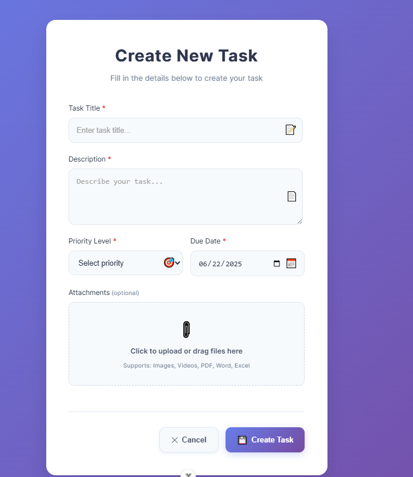
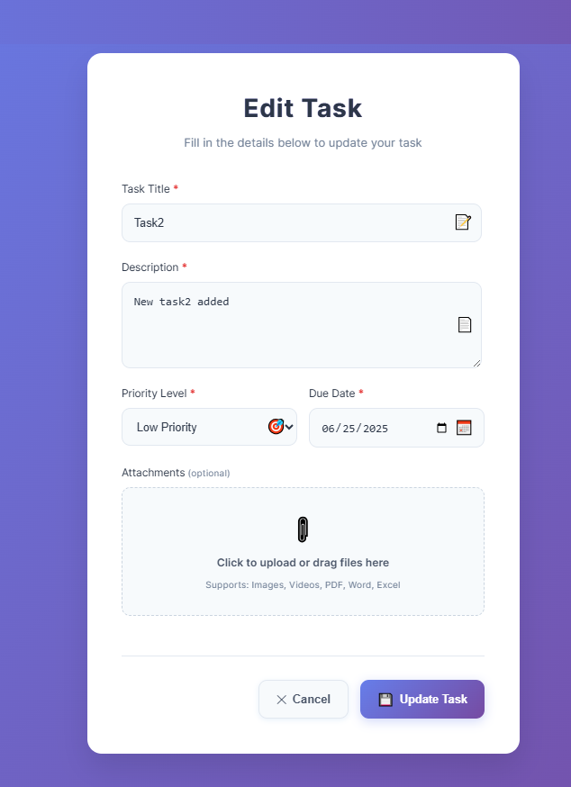
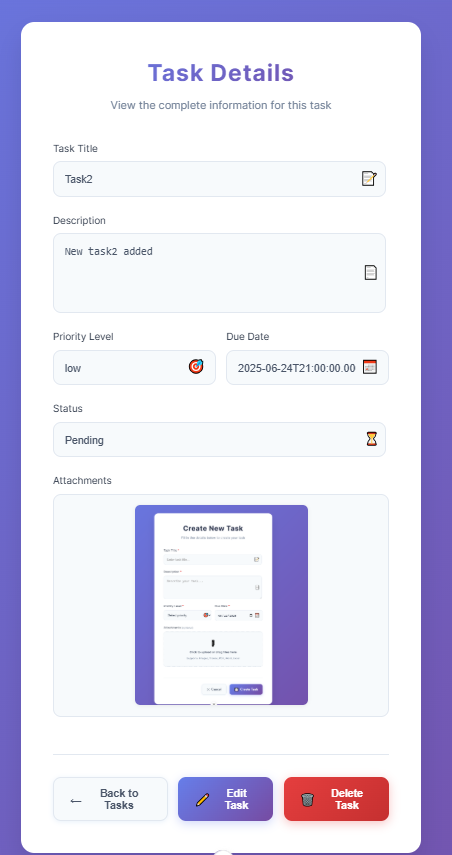
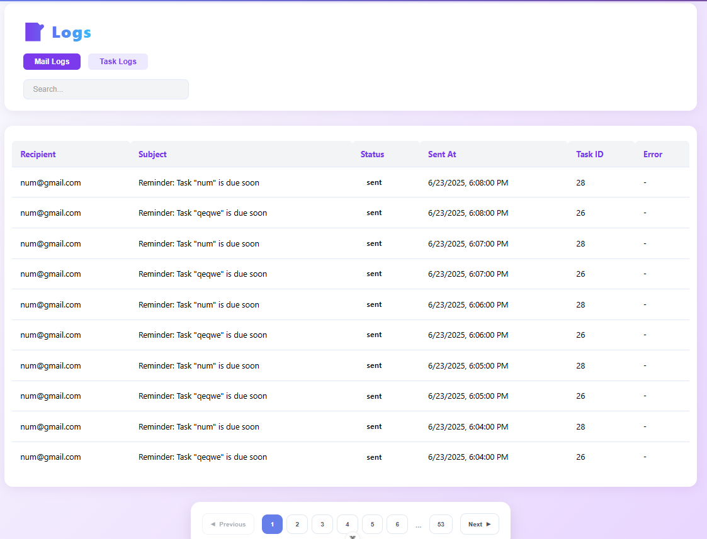
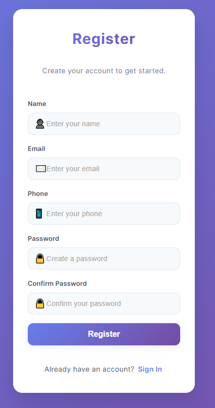

# ✅ Task Management System

Görev oluşturma, güncelleme, silme, tamamlama ve dosya yükleme işlemlerinin yapılabildiği, loglama, hatırlatma ve e-posta servisleri içeren görev yönetim sistemi.

## 🐳 Docker ile Çalıştırma

### 1. Repoyu Klonla

```bash
git clone https://github.com/NumanKilincoglu/task-management.git
cd task-management
```

### 2. Docker Servislerini Başlat
```bash
docker-compose up --build
```

### 3. 🌐 Uygulama Erişim Bilgileri

| Servis      | Açıklama             | Adres                         |
|-------------|----------------------|-------------------------------|
| 🔵 Frontend | Vue 3 Arayüzü       | [http://localhost:5173](http://localhost:5173) |
| 🟡 Backend  | NestJS API Sunucusu | [http://localhost:3002](http://localhost:3002) |

### *** Server/.env File İçeriği ***

```env
JWT_SECRET=6v+Ach9c8ip17uItATVeptjlpTdTCKY6w9y/HWrfafE=
REDIS_URL=redis://localhost:6380
MONGODB_URI=mongodb://mongo:27017/project-logs
PORT=3002
BASE_URL=http://localhost:3002
DB_HOST=db
DB_PORT=3306
DB_USER=root
DB_PASSWORD=pass
DB_NAME=task_manager
```
---

## Veritabanı Şeması

### MySQL - `tasks` Tablosu

```sql
CREATE TABLE tasks (
  id INT AUTO_INCREMENT PRIMARY KEY,
  user_id INT NOT NULL,
  title VARCHAR(255) NOT NULL,
  description TEXT,
  priority ENUM('low', 'medium', 'high') NOT NULL,
  end_date DATE NOT NULL,
  file_path VARCHAR(255),
  file_name VARCHAR(255),
  attachment_type VARCHAR(255),
  is_completed BOOLEAN DEFAULT false,
  created_at TIMESTAMP DEFAULT CURRENT_TIMESTAMP,
  updated_at TIMESTAMP DEFAULT CURRENT_TIMESTAMP ON UPDATE CURRENT_TIMESTAMP,
  FOREIGN KEY (user_id) REFERENCES users(id) ON DELETE CASCADE
);


```

### MySQL - `users` Tablosu

```sql
CREATE TABLE users (
  id INT AUTO_INCREMENT PRIMARY KEY,
  name VARCHAR(255) NOT NULL,
  email VARCHAR(255) NOT NULL UNIQUE,
  password VARCHAR(255) NOT NULL,
  phone VARCHAR(50),
  created_at TIMESTAMP DEFAULT CURRENT_TIMESTAMP,
  updated_at TIMESTAMP DEFAULT CURRENT_TIMESTAMP ON UPDATE CURRENT_TIMESTAMP
);
```

---

### MongoDB Koleksiyonları

#### `tasklogs`

```js
{
  taskId: Number,
  userId: Number,
  action: 'created' | 'updated' | 'completed' | 'deleted',
  changes: String,
  createdBy: String,
  createdAt: Date
}
```

#### `maillogs`

```js
{
  recipient: String,
  subject: String,
  sentAt: Date,
  taskId: Number,
  status: 'sent' | 'failed',
  error: Object
}
```

## 🔁 Özellikler

- 📝 Görev CRUD işlemleri (oluşturma, güncelleme, silme, tamamlama)
- 📁 Dosya yükleme (göreve dosya ekleme)
- 🧠 Redis cache ile görev önbellekleme ve JWT için doğrulama
- 📬 Son tarihi yaklaşan görevler için hatırlatma e-postaları
- 📜 MongoDB ile görev ve e-posta işlemleri için loglama


## 🖼️ Ekran Görüntüleri

### Anasayfa


---

### Görev Oluşturma



---

### Görev Düzenleme



---

### Görev Detay



---

### Log Ekranı



---

### Giriş


---

### Kayıt



---